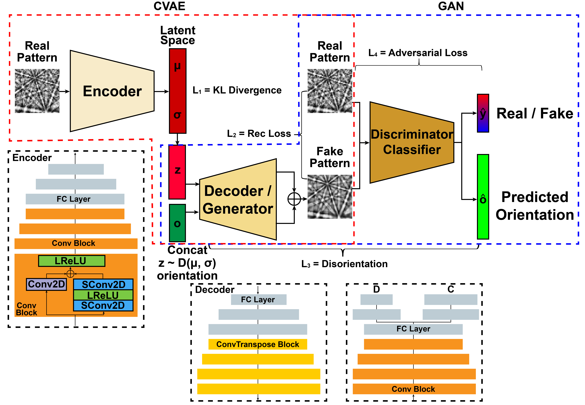

# EBSD_CVAE_GAN_Public
This public repository contains code to reproduce the training of the model [**EBSD-CVAE/GAN**](https://github.com/Darkhunter9/EBSD_CVAE_GAN_Public) proposed in our paper: \
**Parametric Simulation of Electron Backscatter Diffraction Patterns through Generative Models**

<p align="center">

<br>
<b>Architecture of EBSD-CVAE/GAN.</b>
</p>

<p align="center">


<br>
<b>Generated patterns during the training: manipulated attributes include orientation only (left), and manipulated attributes include orientation and accelerating voltage (right).</b>
</p>

## Abstract
Recently, discriminative machine learning (ML) models have been widely used to predict various attributes from Electron Backscatter Diffraction (EBSD) patterns. However, there has never been any generative model developed for EBSD pattern simulation.
On one hand, the training of generative models is much harder than that of discriminative ones; On the other hand, numerous variables affecting EBSD pattern formation make the input space high-dimensional and its relationship with the distribution of backscattered electrons complicated.
In this study, combining two famous generative models, we propose a framework (EBSD-CVAE/GAN) with great flexibility and scalability to realize parametric simulation of EBSD patterns.
Compared with the frequently used forward model, EBSD-CVAE/GAN can take variables more than just orientation and generate corresponding EBSD patterns in a single run.
The accuracy and quality of generated patterns are evaluated through multiple methods.
The model developed does not only summarize a distribution of backscattered electrons at a higher level, but also offers a new idea of mitigating data scarcity in this field.


## Contributors
- [**Zihao Ding**](https://github.com/Darkhunter9)
- [**Marc De Graef**](https://github.com/marcdegraef)
- [**Sergei V. Kalinin**](https://scholar.google.com/citations?user=-cuxoSQAAAAJ&hl=en)


## Requirements
The following packages are required to run the training program:

| Package  | Version  |
| :------------ |:---------------|
| CUDA                  | 11.0    |
| Python                | 3.8.5   |
| pillow                | 8.1.0   |
| numpy                 | 1.18.5  |
| scipy                 | 1.4.1   |
| h5py                  | 2.10.0  |
| scikit-learn          | 0.23.2  |
| tensorflow-gpu        | 2.4.0   |
| tensorflow-probability| 0.12.1  |
| matplotlib            | 3.3.2   |
| opencv                | 4.5.1.48|


## How to use?
Before training the model, you will need to change hyperparameters (values in the dictionary `params`) in the training program, especially those indicating directories of dataset and model. E.g., in `training_CVAE.py`:
```python
params = {  # hyperparam
            'dim': (60,60), # EBSD pattern shape: (h, w)
            'batch_size': 16, # batch size
            'n_channels': (1,), # number of channels
            'n_epochs': 30, # training epochs
            'n_d': 9, # frequency of training discriminator 
                      # (here only used to output fake patterns during training)
            'n_latent': 500, # latent representation dimension
            'n_att': 4, # attribute dimension

            # G
            # losses = loss_rec +
            #          params['g_loss_weight_rec_p'] * loss_rec_p +
            #          params['g_loss_weight_latent'] * loss_latent * tf.case([(loss_latent > 15., lambda: 1.5),
            #                                                                (loss_latent > 5., lambda: 0.1),
            #                                                                ], default=lambda: 0.01)
            'g_loss_weight_rec_p': 0.,
            'g_loss_weight_latent': 0.8,
            'lr_G': 8*10**(-6),

            # directory
            'data': 'dir/to/training_dataset.h5',
            'tmp': 'dir/to/generated_fake_patterns',
            'saved_model': 'dir/to/saved_model.h5',
            'loaded_model': 'dir/to/pre_trained_model.h5',
            'csv': 'dir/to/training_log.csv',}
```
You are also welcome to modify the model architecture in `models.py` based on available resources.
We have tested the current architecture and batch size on a Nvidia V100 gpu with 32GB memory.

In terms of data availability, the training and testing datasets are available upon request. We are also uploading them to CMU [KiltHub](https://kilthub.cmu.edu/).

Finally, you can start the training:
```bash
cd EBSD_CVAE_GAN_Public
python training_CVAE.py
```

## Contribute
Have you spotted a typo, would you like to fix a bug, or is there something you’d like to suggest? You are welcome to open a pull request. We will do our best to review your proposal in due time.

In addition, you can also email [**Zihao**](mailto:ding@cmu.edu) should you have any questions or suggestions.


## Acknowledgements
We want to express our sincere gratitude to the funding sources and facilities (in no particular order):

- Vannevar-Bush fellowship from the Office of Naval Research (ONR N00014-16-1-2821)
- Materials Characterization Facility at Carnegie Mellon University supported by grant MCF-677785
- Computational facilities purchased with funds from the
National Science Foundation (NSF Grant #1925717: CC* Compute: A high-performance GPU cluster for accelerated research) and administered by the Center for Scientific Computing (CSC). The CSC is supported by the California NanoSystems Institute and the Materials Research Science and Engineering Center (MRSEC; NSF DMR 1720256) at UC Santa Barbara.


## License
```
BSD 3-Clause License

Copyright (c) 2022, Zihao Ding, Marc De Graef Research Group/Carnegie Mellon University
All rights reserved.

Redistribution and use in source and binary forms, with or without
modification, are permitted provided that the following conditions are met:

1. Redistributions of source code must retain the above copyright notice, this
   list of conditions and the following disclaimer.

2. Redistributions in binary form must reproduce the above copyright notice,
   this list of conditions and the following disclaimer in the documentation
   and/or other materials provided with the distribution.

3. Neither the name of the copyright holder nor the names of its
   contributors may be used to endorse or promote products derived from
   this software without specific prior written permission.

THIS SOFTWARE IS PROVIDED BY THE COPYRIGHT HOLDERS AND CONTRIBUTORS "AS IS"
AND ANY EXPRESS OR IMPLIED WARRANTIES, INCLUDING, BUT NOT LIMITED TO, THE
IMPLIED WARRANTIES OF MERCHANTABILITY AND FITNESS FOR A PARTICULAR PURPOSE ARE
DISCLAIMED. IN NO EVENT SHALL THE COPYRIGHT HOLDER OR CONTRIBUTORS BE LIABLE
FOR ANY DIRECT, INDIRECT, INCIDENTAL, SPECIAL, EXEMPLARY, OR CONSEQUENTIAL
DAMAGES (INCLUDING, BUT NOT LIMITED TO, PROCUREMENT OF SUBSTITUTE GOODS OR
SERVICES; LOSS OF USE, DATA, OR PROFITS; OR BUSINESS INTERRUPTION) HOWEVER
CAUSED AND ON ANY THEORY OF LIABILITY, WHETHER IN CONTRACT, STRICT LIABILITY,
OR TORT (INCLUDING NEGLIGENCE OR OTHERWISE) ARISING IN ANY WAY OUT OF THE USE
OF THIS SOFTWARE, EVEN IF ADVISED OF THE POSSIBILITY OF SUCH DAMAGE.
```